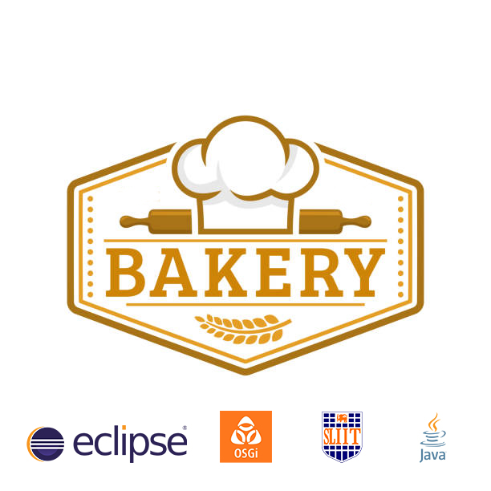

<!--
*** Thanks for checking out the Best-README-Template. If you have a suggestion
*** that would make this better, please fork the repo and create a pull request
*** or simply open an issue with the tag "enhancement".
*** Don't forget to give the project a star!
*** Thanks again! Now go create something AMAZING! :D
--> 

<!-- PROJECT SHIELDS -->
<!--
*** I'm using markdown "reference style" links for readability.
*** Reference links are enclosed in brackets [ ] instead of parentheses ( ).
*** See the bottom of this document for the declaration of the reference variables
*** for contributors-url, forks-url, etc. This is an optional, concise syntax you may use.
*** https://www.markdownguide.org/basic-syntax/#reference-style-links
-->
[![Contributors][contributors-shield]][contributors-url]
[![Forks][forks-shield]][forks-url]
[![Stargazers][stars-shield]][stars-url]
[![Issues][issues-shield]][issues-url]
[![MIT License][license-shield]][license-url]

  

<!-- PROJECT LOGO -->
 

  

  <h3 align="center">OSGI FrameWork for Bakery Shop</h3>

  

    <a href="https://www.sliit.lk/"><strong>Sri Lanka Institute of Information Technology</strong></a>
     
    Software Architecture - SE3030
     
     
    <a href="Docs/SE3030_SA_Assignment01_and_MarkingScheme_2022.pdf">Assignment 01 </a>
     
    SE3030_WE_72
     
    
  

<!-- TABLE OF CONTENTS -->

  
Table of Contents

  <ol>
    <li>
      <a href="#Scenario">Scenario</a>
      <ul>
        <li><a href="#built-with">Built With</a></li>
      </ul>
    </li>
    <li>
      <a href="#Workflows">Workflows</a>
      <ul>
        <li><a href="#Customer-workflow">Customer workflow</a></li>
        <li><a href="#Admin-workflow">Admin workflow</a></li>
        <li><a href="#Cook-workflow">Cook workflow</a></li>
        <li><a href="#Delivery-Workflow">Delivery Workflow</a></li>
      </ul>
    </li>
    <li><a href="#Manifest-implementation-(Exported-services/imported-services)">Manifest implementation (Exported services / imported services)</a>
    <ul>
        <li><a href="#Bakery-Item-Producer">Bakery Item Producer</a></li>
        <li><a href="#Bakery-Item-Producer">Bakery Item Producer</a></li>
        <li><a href="#Bakery-Delivery-Consumer">Bakery Delivery Consumer</a></li>
        <li><a href="#Bakery-Customer-Producer">Bakery Customer Producer</a></li>
        <li><a href="#Bakery-Customer-Consumer">Bakery Customer Consumer</a></li>
         <li><a href="#Bakery-Cook-Producer">Bakery Cook Producer</a></li>
          <li><a href="#Bakery-Cook-Consumer">Bakery Cook Consumer</a></li>
           <li><a href="#Bakery-Admin-Consumer">Bakery Admin Consumer</a></li>
      </ul>
    </li>
    <li><a href="#roadmap">Roadmap</a>
    <ul>
        <li><a href="#Commands-of-bundle-install-and-run-in-OSGi-framework.">Commands of bundle install and run in OSGi framework. </a></li>
        <li><a href="#Sample-screenshots of its behavior & outputs.">Sample screenshots of its behavior & outputs. </a></li>
      </ul>
    </li>
    <li><a href="#contributing">Contributing</a></li>
    <li><a href="#license">License</a></li>
    <li><a href="#contact">Contact</a></li>
    <li><a href="#acknowledgments">Acknowledgments</a></li>
  </ol>

<!-- ABOUT THE PROJECT -->
## Scenario

Our system is being used to run a bakery shop. Customer consumer can create an account with the store. Then they'll be able to place orders. The administrator user can add items to the store and create accounts for delivery people. Customers' orders will be accepted by the cook consumer, who will also be able to add recopies to the store. The delivery person consumer can then accept deliveries and update the status of those that have been completed.

If a customer already has an account, they will be asked to login during the registration process. They will be asked to enter their name, phone number, email address, and address if they do not already have one.

During the process of adding an item, the administrator should enter the item's name, category, price, and quantity. The administrator can also register delivery people by providing their name, phone number, and login username and password.
By entering the food item, recipe Id and name, and recipe description into the store system, the cook will save recipes to the system. The cook also can retrieve customer order information, update the status, and send the information to the delivery person.
The delivery person will retrieve delivery information and, once the delivery has been completed, they will be able to update the delivery status.

(<a href="#top">back to top</a>)

### Built With

Microkernel architecture pattern  
The microkernel architecture pattern (sometimes referred to as the plug-in architecture pattern) is a natural pattern for implementing product-based applications. A product-based application is one that is packaged and made available for download in versions as a typical third-party product. However, many companies also develop and release their internal business applications like software products, complete with versions, release notes, and pluggable features. These are also a natural fit for this pattern. The microkernel architecture pattern allows you to add additional application features as plug-ins to the core application, providing extensibility as well as feature separation and isolation.

(<a href="#top">back to top</a>)

## Workflows
### Customer workflow
 
    

### Admin workflow
 
    

### Cook workflow
 
    

### Delivery Workflow
 
    

(<a href="#top">back to top</a>)

## Manifest implementation (Exported services / imported services)

### Bakery Item Producer
 
    

### Bakery Delivery Producer
 
    

### Bakery Delivery Consumer
 
    

### Bakery Customer Producer
 
    

### Bakery Cook Producer
 
    

### Bakery Cook Consumer
 
    

### Baker Item Producer
 
    

### Bakery Admin Consumer
 
    

(<a href="#top">back to top</a>)

<!-- ROADMAP -->
## Roadmap

- [x] Open the project via Eclipse
- [x] Run All the MANIFEST.MF

### Commands of bundle install and run in OSGi framework. 

 
    Admin Consumer & Producer and Item Producer Active State 
    

 
    Check Admin Producer and Items Producer connectivity with the Admin Consumer 
    

 
    Bakery Customer Consumer & Producer and Bakery Items Producer Active State 
    

 
    Check Customer Producer and Items Producer connectivity with the Customer Consumer 
    

 
    Bakery Cook Consumer and Bakery Admin Producer Active State 
    

 
    Check Bakery Cook Consumer connectivity with Bakery Admin Producer 
    

 
    Delivery Consumer & Producer and Item Producer Active State
    

 
    Check Delivery Consumer & Producer and Item Producer connectivity
    

### Sample screenshots of its behavior & outputs.

 
    Add Items to the bakery 
    

 
    Add delivery person 
    

 
    Customer registration 
    

 
    Customer Login 
    

 
    Buy Items 
    
    
    

 
    Adding a recipe 
    

 
    Driver Login and Show Delivary list 
    

See the [open issues](amila1998/OSGI_FrameWork-Bakery-Shop/issues) for a full list of proposed features (and known issues).

(<a href="#top">back to top</a>)

<!-- CONTRIBUTING -->
## Contributing

Contributions are what make the open source community such an amazing place to learn, inspire, and create. Any contributions you make are **greatly appreciated**.

If you have a suggestion that would make this better, please fork the repo and create a pull request. You can also simply open an issue with the tag "enhancement".
Don't forget to give the project a star! Thanks again!

1. Fork the Project
2. Create your Feature Branch
3. Commit your Changes
4. Push to the Branch 
5. Open a Pull Request

(<a href="#top">back to top</a>)

<!-- LICENSE -->
## License

Distributed under the SLIIT License.

(<a href="#top">back to top</a>)

<!-- CONTACT -->
## Contact

Group Leader - [Wijesuriya W A D J K D - IT20750374](https://www.linkedin.com/in/kevin-wijesooriya-1b0197226/) - it20750374@my.sliit.lk

Member - [Senarathne S M A D - IT20089436](https://www.linkedin.com/in/amila-devin-37811b83/) - it20089436@my.sliit.lk

Member - [Udayantha Yapa Y M S - IT20045708](https://www.linkedin.com/in/sean-udayantha/) - it20045708@my.sliit.lk

Member - [Kumarasingha S N - IT20151638](https://www.linkedin.com/in/sithara-kumarasingha-161647229/) - it20151638@my.sliit.lk

Project Link: [https://github.com/amila1998/OSGI_FrameWork-Bakery-Shop](https://github.com/amila1998/OSGI_FrameWork-Bakery-Shop)

(<a href="#top">back to top</a>)

<!-- ACKNOWLEDGMENTS -->
## Acknowledgments

Thank all SLIIT Lectures and who helps to develope and understand this Architecture

(<a href="#top">back to top</a>)

<!-- MARKDOWN LINKS & IMAGES -->
<!-- https://www.markdownguide.org/basic-syntax/#reference-style-links -->
[contributors-shield]: https://img.shields.io/github/contributors/amila1998/OSGI_FrameWork-Bakery-Shop.svg?style=for-the-badge
[contributors-url]: https://github.com/amila1998/OSGI_FrameWork-Bakery-Shop/graphs/contributors
[forks-shield]: https://img.shields.io/github/forks/amila1998/OSGI_FrameWork-Bakery-Shop.svg?style=for-the-badge
[forks-url]: https://github.com/amila1998/OSGI_FrameWork-Bakery-Shop/network/members
[stars-shield]: https://img.shields.io/github/stars/amila1998/OSGI_FrameWork-Bakery-Shop.svg?style=for-the-badge
[stars-url]: https://github.com/amila1998/OSGI_FrameWork-Bakery-Shop/stargazers
[issues-shield]: https://img.shields.io/github/issues/amila1998/OSGI_FrameWork-Bakery-Shop.svg?style=for-the-badge
[issues-url]: https://github.com/amila1998/OSGI_FrameWork-Bakery-Shop/issues
[license-shield]: https://img.shields.io/github/license/amila1998/OSGI_FrameWork-Bakery-Shop.svg?style=for-the-badge
[license-url]: https://github.com/amila1998/OSGI_FrameWork-Bakery-Shop/blob/master/LICENSE.txt
[linkedin-shield]: https://img.shields.io/badge/-LinkedIn-black.svg?style=for-the-badge&logo=linkedin&colorB=555
[linkedin-url]: https://linkedin.com/in/othneildrew
[product-screenshot]: images/screenshot.png

